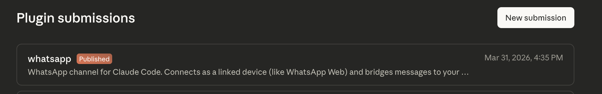

# WhatsApp MCP Server for Claude Code: Run AI Directly from WhatsApp

[](https://claude.com/plugins)
[](https://claude.com/plugins)
[](https://modelcontextprotocol.io)
[](https://www.typescriptlang.org/)
[](https://opensource.org/licenses/Apache-2.0)
[](https://github.com/Rich627/whatsapp-claude-plugin)

> **Published on the [Anthropic Official Plugin Marketplace](https://claude.com/plugins)** — the first community-built WhatsApp channel plugin to be officially reviewed and published by Anthropic.



Connect WhatsApp as a native channel to your Claude Code session using this MCP server plugin. Automate tasks, execute code, search files, and interact with Claude AI directly from WhatsApp messaging—no bots, no API keys, just your personal WhatsApp account connected as a linked device. Built on Baileys for reliable WhatsApp Web connectivity.

## Key Features

- **Bidirectional messaging** — send and receive WhatsApp messages directly from your Claude Code session
- **Full media support** — photos, voice notes, video, documents, and stickers
- **Automatic voice transcription** — voice messages transcribed with mlx-whisper
- **Access control** — allowlists, pairing codes, and group policies to control who can interact
- **Per-group personalities** — customize Claude's behavior for each WhatsApp group
- **Permission relay** — approve or deny Claude's tool requests remotely from WhatsApp
- **Scheduled cron tasks** — set up recurring automated tasks via server-side cron engine
- **Dual-account setup** — run personal and bot accounts simultaneously

## Quick Start

```sh
# 1. Add this marketplace (one-time)
claude plugin marketplace add Rich627/whatsapp-claude-plugin

# 2. Install the plugin
claude plugin install whatsapp@whatsapp-claude-plugin

# 3. Launch Claude Code — the plugin loads automatically
claude
```

Inside the session, configure your phone number and pair:

```
/whatsapp:configure <phone>   # country code + number, no +
```

On first launch, a pairing code is printed to your terminal. On your phone: WhatsApp > Settings > Linked Devices > Link a Device > **Link with phone number instead** > enter the code.

## How It Works

```
WhatsApp (phone) <──Baileys──> MCP Server <──stdio──> Claude Code
```

1. The MCP server connects to WhatsApp as a **linked device** using the Baileys library (same protocol as WhatsApp Web)
2. Incoming messages are forwarded to your Claude Code session as channel notifications
3. Claude responds using MCP tools (`reply`, `react`, `edit_message`, `download_attachment`)
4. Access control ensures only allowlisted contacts can interact

> Messages sent by Claude appear as coming from your phone number. Use a dedicated number if you need a separate bot identity.

## Use Cases

- **Personal AI assistant** — message Claude from anywhere via WhatsApp, get answers, run code, and manage tasks on the go
- **Team support bot** — add Claude to a WhatsApp group with custom personality and let it help your team
- **Remote development** — approve Claude's tool requests and monitor progress from WhatsApp when away from your desk
- **Automated notifications** — use cron tasks to send scheduled reports or reminders through WhatsApp
- **Multi-account management** — run separate personal and business WhatsApp accounts with different Claude behaviors

## FAQ

**Q: Do I need a WhatsApp Business API account?**
A: No. This plugin connects as a linked device to your regular WhatsApp account—no Business API, no Meta developer account, no API keys needed.

**Q: Can people tell it's AI responding?**
A: No, messages come from your phone number. Recipients see no difference. Use a separate number if you want a distinct bot identity.

**Q: Does it work when my phone is off?**
A: Yes. WhatsApp linked devices work independently once paired. Your Claude Code session must stay open though.

**Q: Is my data sent to third parties?**
A: No. The MCP server runs locally on your machine. Messages go directly between WhatsApp and your local Claude Code session.

**Q: What happens if Claude Code disconnects?**
A: The WhatsApp session disconnects too. Just relaunch—no re-pairing needed, auth is saved locally.

## Troubleshooting

| Issue | Solution |
|-------|----------|
| Pairing code not showing | Run `/whatsapp:configure <phone>` first, then relaunch |
| 440 disconnect error | Only one connection per auth state allowed. Kill stale processes: `pkill -f "whatsapp.*server"` |
| Messages not arriving | Known Claude Code client bug ([#37933](https://github.com/anthropics/claude-code/issues/37933)). Server-side is correct, awaiting client fix. |
| Auth expired | Run `/whatsapp:configure reset-auth` and re-pair |
| Voice transcription not working | See [voice transcription setup](#voice-transcription-setup-optional) below |

## Voice transcription setup (optional)

Incoming voice messages are auto-transcribed via a user script at `~/whisper-transcribe.sh`. If the script is missing, voice messages are delivered as untranscribed attachments.

One-time setup (Apple Silicon, mlx-whisper):

```bash
# 1. ffmpeg (mlx-whisper uses it to decode audio)
brew install ffmpeg

# 2. Python venv + mlx-whisper
python3 -m venv ~/whisper-env
source ~/whisper-env/bin/activate
pip install mlx-whisper

# 3. Install the transcribe script
cp plugins/whatsapp-channel/scripts/whisper-transcribe.sh ~/whisper-transcribe.sh
chmod +x ~/whisper-transcribe.sh

# 4. (Optional) Test it
~/whisper-transcribe.sh path/to/sample.ogg
```

The reference script uses `mlx-community/whisper-large-v3-turbo` — accurate, fast, multilingual. Swap the model in the script if you prefer a smaller one.

## Documentation

See [plugins/whatsapp-channel/README.md](./plugins/whatsapp-channel/README.md) for full documentation including access control, dual-account setup, fine-grained permissions, and more.

## License

[Apache 2.0](./plugins/whatsapp-channel/LICENSE) — Copyright 2025 Richie Liu
